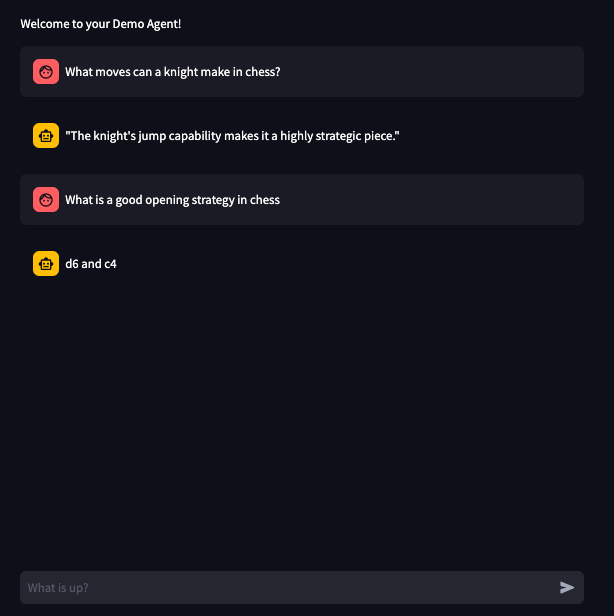

# EECS-449-Warmup-Assignment
PART 1 SCREENSHOTS:

Swagger Documentation:

Count Letters Walker Response:

Addition Walker Response:

PART 2 SCREENSHOTS:

Both screenshots below are response from two different LLMs about my the chess theory doc that I added.  As you can tell, one model was much more informative than the other...

Llama 3.2:1b Response:

Qwen Response:

PART 3 SCREENSHOTS:

